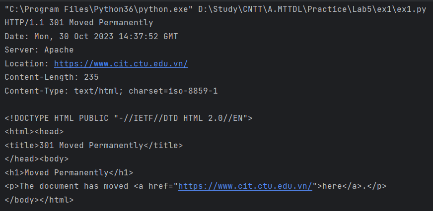
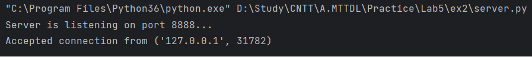
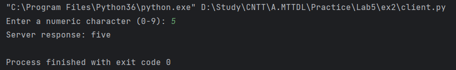
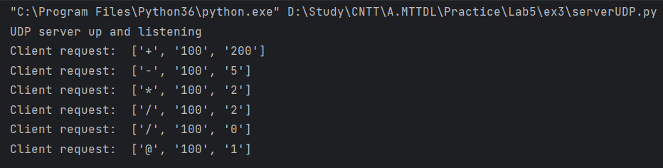
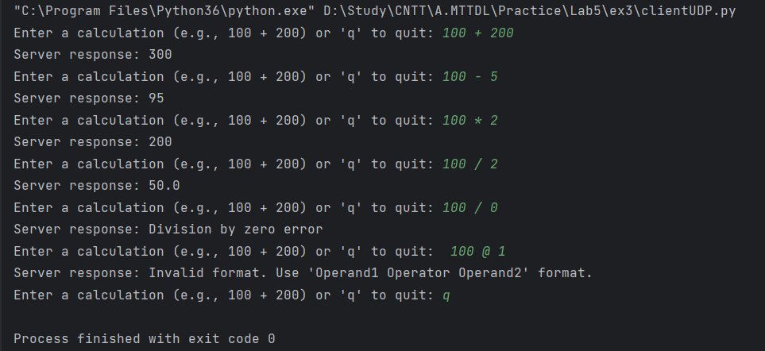
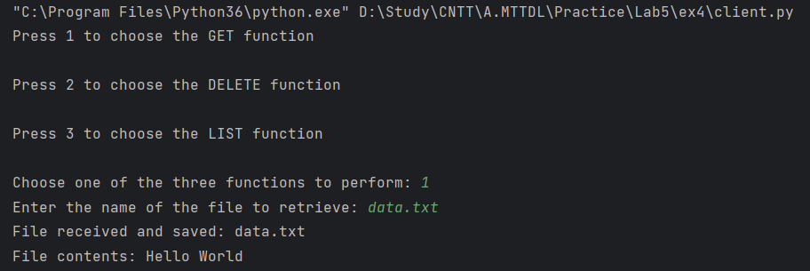
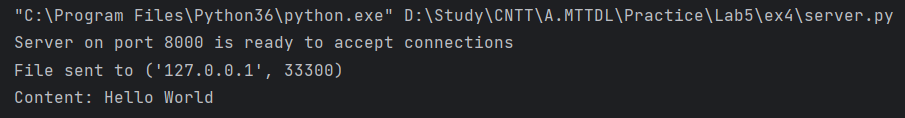
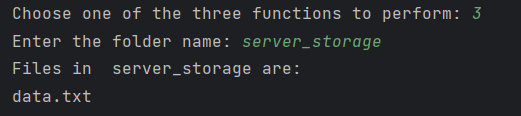
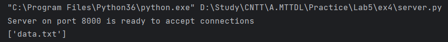
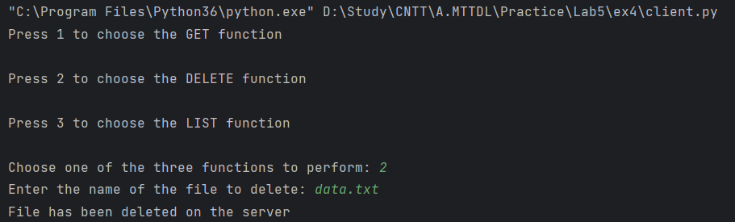

## Exercise 1
* Code:

```sh
import socket

# Define function
def get_and_display_html(url):
    # Extract the host and path from the URL
    if "://" in url:
        parts = url.split('/')
        host = parts[2]
        path = '/' + '/'.join(parts[3:])
    else:
        # Assuming HTTP if no protocol is specified
        parts = url.split('/')
        host = parts[0]
        path = '/' + '/'.join(parts[1:])

    # Create a TCP socket
    client_socket = socket.socket(socket.AF_INET, socket.SOCK_STREAM)

    try:
        # Connect to the web server on port 80 (HTTP)
        client_socket.connect((host, 80))

        # Send an HTTP GET request for the specified path
        request = f"GET {path} HTTP/1.1\r\nHost: {host}\r\n\r\n"
        client_socket.send(request.encode())

        # Receive and display the response
        while True:
            data = client_socket.recv(1024)
            if not data:
                break
            print(data.decode(), end='')

    except socket.error as e:
        print(f"Error: {e}")

    finally:
        client_socket.close()
```
* Run code:

```sh
# Run function
get_and_display_html("www.cit.ctu.edu.vn")
```

* Result:



## Exercise 2

* Server:
```sh
import socket

def convert_to_word(data):
    conversion_dict = {
        '0': "zero",
        '1': "one",
        '2': "two",
        '3': "three",
        '4': "four",
        '5': "five",
        '6': "six",
        '7': "seven",
        '8': "eight",
        '9': "nine"
    }

    return conversion_dict.get(data, "Not an integer")

def main():
    server_socket = socket.socket(socket.AF_INET, socket.SOCK_STREAM)
    server_socket.bind(('0.0.0.0', 8888))
    server_socket.listen(1)
    print("Server is listening on port 8888...")

    while True:
        client_socket, client_address = server_socket.accept()
        print(f"Accepted connection from {client_address}")

        data = client_socket.recv(1).decode()

        response = convert_to_word(data)
        client_socket.send(response.encode())

        client_socket.close()

if __name__ == "__main__":
    main()
```

* Client:
```sh
import socket

def main():
    client_socket = socket.socket(socket.AF_INET, socket.SOCK_STREAM)
    client_socket.connect(('localhost', 8888))

    user_input = input("Enter a numeric character (0-9): ")

    if len(user_input) == 1 and user_input.isnumeric():
        client_socket.send(user_input.encode())
        response = client_socket.recv(1024).decode()
        print(f"Server response: {response}")
    else:
        print("Invalid input. Please enter a single numeric character (0-9).")

    client_socket.close()

if __name__ == "__main__":
    main()
```

* Result:




## Exercise 3

* Server:
```sh
import socket

localIP = "127.0.0.1"
localPort = 20001
bufferSize = 1024

UDPServerSocket = socket.socket(family=socket.AF_INET, type=socket.SOCK_DGRAM)
UDPServerSocket.bind((localIP, localPort))

print("UDP server up and listening")

while True:
    data, address = UDPServerSocket.recvfrom(bufferSize)
    message = data.decode('utf-8').strip()

    try:
        parts = message.split()

        print("Client request: ", parts)  # format: ['+', '100', '200']

        result = 0

        if len(parts) == 3 and parts[0] in ('+', '-', '*', '/') and parts[1].isdigit() and parts[2].isdigit():
            operand1, operator, operand2 = int(parts[1]), parts[0], int(parts[2])

            if operator == '+':
                result = operand1 + operand2
            elif operator == '-':
                result = operand1 - operand2
            elif operator == '*':
                result = operand1 * operand2
            elif operator == '/':
                if operand2 != 0:
                    result = operand1 / operand2
                else:
                    UDPServerSocket.sendto("Division by zero error".encode('utf-8'), address)
                    continue

            UDPServerSocket.sendto(str(result).encode('utf-8'), address)
        else:
            UDPServerSocket.sendto("Invalid format. Use 'Operand1 Operator Operand2' format.".encode('utf-8'), address)
    except (ValueError, IndexError):
        UDPServerSocket.sendto("Invalid format. Use 'Operand1 Operator Operand2' format.".encode('utf-8'), address)
```

* Client:
```sh
import socket

serverAddressPort = ("127.0.0.1", 20001)
bufferSize = 1024

UDPClientSocket = socket.socket(family=socket.AF_INET, type=socket.SOCK_DGRAM)

while True:
    user_input = input("Enter a calculation (e.g., 100 + 200) or 'q' to quit: ")

    if user_input.lower() == 'q':
        break

    try:
        operator, operands = user_input.split()[1], user_input.split()[:1] + user_input.split()[2:]
        formatted_message = f"{operator} {' '.join(operands)}"

        message = formatted_message.encode('utf-8')
        UDPClientSocket.sendto(message, serverAddressPort)

        response, _ = UDPClientSocket.recvfrom(bufferSize)
        print(f"Server response: {response.decode('utf-8')}")
    except ValueError:
        print("Invalid input. Use 'Operand1 Operator Operand2' format.")
```

* Result:



## Exercise 4

* Server:
```sh
import socket
import os

HOST = 'localhost'
PORT = 8000
PORT1 = 8001

server = socket.socket(socket.AF_INET, socket.SOCK_STREAM)
server.bind((HOST, PORT))

server1 = socket.socket(socket.AF_INET, socket.SOCK_STREAM)
server1.bind((HOST, PORT1))

server.listen(1)
server1.listen(1)

print('Server on port 8000 is ready to accept connections')

while True:
    conn, add = server.accept()
    conn1, add1 = server1.accept()

    request = conn.recv(1024).decode('utf-8')
    filename = request.split()[1]
    method = request.split()[0]

    if method == 'GET':
        if os.path.isfile("server_storage/" + filename):
            conn.send(b'OK\n')
            with open("server_storage/" + filename, 'r') as f:
                data = f.read()
                conn1.send(data.encode('utf-8'))
            print('File sent to', add)
            print('Content:', data)
        else:
            print('File not found:', filename)
            conn.send(b'ERROR\n')

    if method == 'DELETE':
        file_path = os.path.join("server_storage", filename)
        if os.path.isfile(file_path):
            conn.send(b'OK\n')
            os.remove(file_path)
            print("File", filename, "has been deleted from the server's server_storage directory")
        else:
            conn.send(b'ERROR\n')
            print('File not found:', filename)

    if method == 'LIST':
        if os.path.isdir(filename):
            conn.send(b'OK\n')
            files = os.listdir(filename)
            print(files)
            data = (str(files).encode('utf-8'))
            conn1.send(data)
        else:
            conn.send('ERROR\n'.encode('utf-8'))
            print('Folder not found:', filename)
    conn.close()
    conn1.close()
```

* Client:
```sh
import socket

HOST = 'localhost'
PORT = 8000
PORT1 = 8001

def handle_get():
    client = socket.socket(socket.AF_INET, socket.SOCK_STREAM)
    client.connect((HOST, PORT))

    client1 = socket.socket(socket.AF_INET, socket.SOCK_STREAM)
    client1.connect((HOST, PORT1))

    filename = input('Enter the name of the file to retrieve: ')
    request = 'GET ' + filename
    client.send(request.encode('utf-8'))

    response = client.recv(1024).decode('utf-8')

    if response == 'OK\n':
        with open(filename, 'w') as f:
            while True:
                data = client1.recv(1024)
                if not data:
                    break
                f.write(data.decode('utf-8'))
        print('File received and saved:', filename)
        with open(filename, 'r') as a:
            contents = a.read()
            print("File contents:", contents, "\n")
    else:
        print("Server on port 8000 Response:", response)

def handle_delete():
    client = socket.socket(socket.AF_INET, socket.SOCK_STREAM)
    client.connect((HOST, PORT))

    client1 = socket.socket(socket.AF_INET, socket.SOCK_STREAM)
    client1.connect((HOST, PORT1))

    filename = input('Enter the name of the file to delete: ')
    request = 'DELETE ' + filename
    client.send(request.encode('utf-8'))

    response = client.recv(1024).decode('utf-8')

    if response == 'OK\n':
        print("File has been deleted on the server")
    else:
        print("Server on port 8000 Response:", response)

def handle_list():
    client = socket.socket(socket.AF_INET, socket.SOCK_STREAM)
    client.connect((HOST, PORT))

    client1 = socket.socket(socket.AF_INET, socket.SOCK_STREAM)
    client1.connect((HOST, PORT1))

    filename = input('Enter the folder name: ')
    request = 'LIST ' + filename
    client.send(request.encode('utf-8'))

    response = client.recv(1024).decode('utf-8')

    if response == 'OK\n':
        file = client1.recv(1024)
        array = eval(file.decode('utf-8'))
        print("Files in ", filename, "are:")
        for f in array:
            print(f)
        print("\n")
    else:
        print("Server on port 8000 Response:", response)

test = True
while test:
    print("Press 1 to choose the GET function\n")
    print("Press 2 to choose the DELETE function\n")
    print("Press 3 to choose the LIST function\n")
    a = (input("Choose one of the three functions to perform: "))
    if a == '1':
        handle_get()
    if a == '2':
        handle_delete()
    if a == '3':
        handle_list()
    if a == '':
        test = False
        print("End of work session")
```

## Method GET:
### Client request:

### Server response:


## Method LIST:
### Client request:

### Server response:


## Method DELETE:
### Client request:

### Server response:
